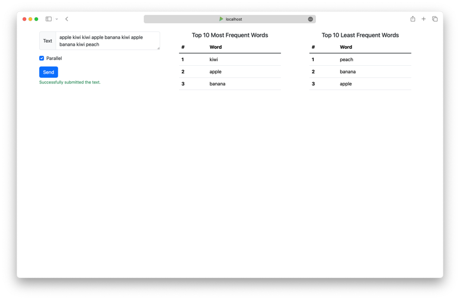
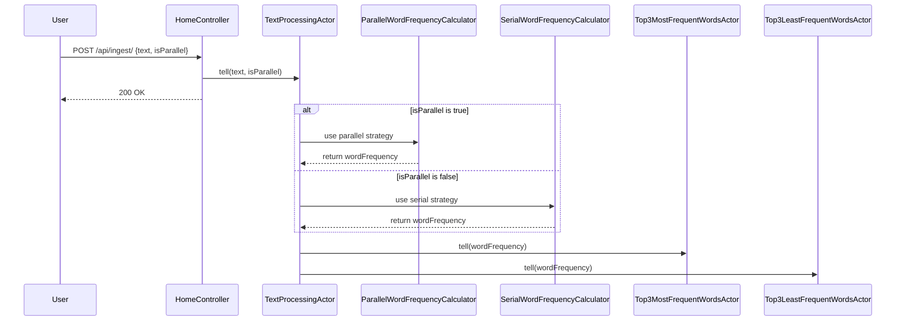
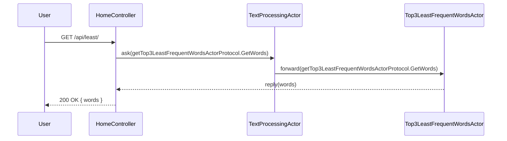
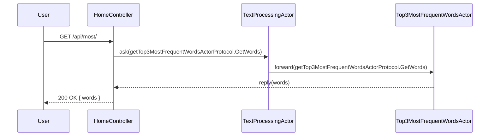
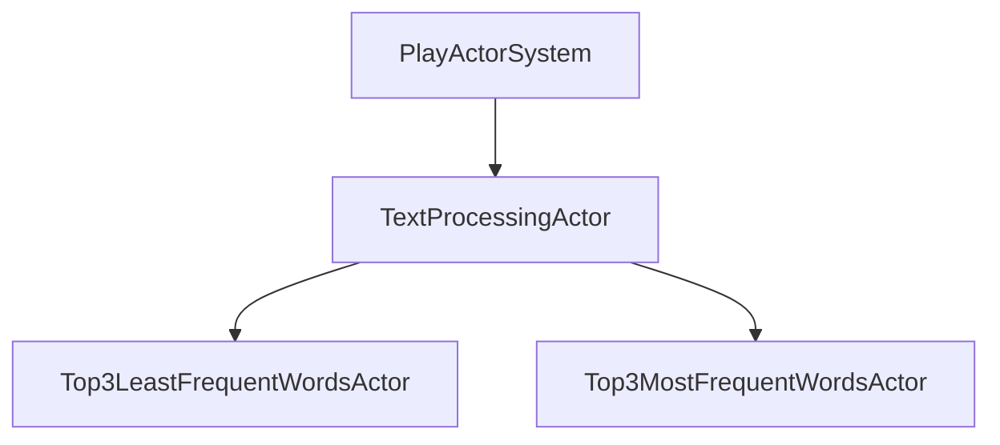

# Sieve

Sieve uses reactive programming in Java to implement a simple web application that keeps track of the top 3 most and least common words across all the text that is sent to it. It also has the ability to process the ingested text in either parallel or sequential mode using [Java Streams](https://docs.oracle.com/javase/8/docs/api/java/util/stream/Stream.html).

It is based on [Play Framework](https://www.playframework.com/), a high velocity web framework for Java and Scala.

It also includes an interactive web page based on [VueJs](https://vuejs.org/) to input text and view the top 3 most and least frequent words live.



## Table of Contents

- [API](#api)
- [Design](#design)
  - [Word Frequency Calculation](#word-frequency-calculation)
    - [Parallization](#parallization)
  - [API Interactions](#api-interactions)
    - [Ingest API](#ingest-api)
    - [Least API](#least-api)
    - [Most API](#most-api)
  - [Actor Hierarchy](#actor-hierarchy)
- [How to run](#how-to-run)
- [Testing](#testing)

## API

| HTTP Method | Endpoint       | Description                                                                                     | Parameters | Request Body                                  | Response                                            |
|-------------|----------------|-------------------------------------------------------------------------------------------------|------------|-----------------------------------------------|-----------------------------------------------------|
| GET         | `/`            | Serves an interactive page to input text and view the top 3 most and least frequent words live. | N/A        | N/A                                           | `200 OK`                                            |
| POST        | `/api/ingest/` | Processes the text sent (in parallel if set to true)                                            | N/A        | `{ "text": "string", "parallel": "boolean" }` | `200 OK`                                            |
| GET         | `/api/least/`  | Retrieves the top 3 least frequent words.                                                       | N/A        | N/A                                           | `200 OK` with JSON `{ "words" : [word1, word2 ..]}` |
| GET         | `/api/most/`   | Retrieves the top 3 most frequent words.                                                        | N/A        | N/A                                           | `200 OK` with JSON `{ "words" : [word1, word2 ..]}` |

## Design

### Word Frequency Calculation
The word frequency calculation is done by the `WordFrequencyCalculator` interface. It has two implementations:
- `SerialWordFrequencyCalculator` which uses a serial approach to calculate the word frequency.
- `ParallelWordFrequencyCalculator` which uses a parallel approach to calculate the word frequency.

The implementation follows the [Strategy Pattern](https://en.wikipedia.org/wiki/Strategy_pattern) to allow for easy switching between the two strategies.

The input text is modeled as a stream of Characters to make use of Java Streams API. `StreamWordCounter` implements the core logic to calculate the word frequency and it does so sequentially.

#### Parallization
Parallelization is achieved by using a [Spliterator](https://docs.oracle.com/javase/8/docs/api/java/util/Spliterator.html) to split the stream of characters into multiple parts. Each part is then processed in parallel using the `StreamWordCounter` to calculate the word frequency. The results are then combined to get the final word frequency.

### API Interactions
#### Ingest API



#### Least API



#### Most API


### Actor Hierarchy


## How to run

```bash
# Check prerequisites

# Java 17 or higher
$ java -version

# sbt 1.10.1 or higher
$ sbt -version

# To install sbt on mac
$ brew install sbt

# Clone the repository
$ git clone https://github.com/navin-mohan/sieve.git

# Change directory
$ cd sieve

# Run the application
$ sbt run

# Open the browser and navigate to http://localhost:9000
```

## Testing
[Test Report](test-report.html)

